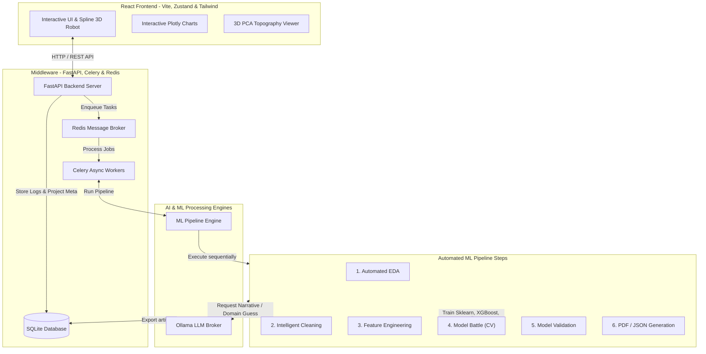

# AutoDS: The End-to-End AI Data Science Platform

AutoDS is an automated machine learning (AutoML) and generative AI platform designed to transform raw datasets into clean, optimized models and client-ready reports instantly. By combining traditional machine learning workflows with large language models (LLMs) and interactive web layouts, AutoDS eliminates the boilerplate of data preparation, model training, and performance reporting.

---


## System Architecture & Engine Layout

AutoDS utilizes a robust multi-layered architecture to process data asynchronously and generate visual and textual reports:



### Technical Stack
*   **Frontend**: React (Vite), Zustand (state management), TailwindCSS, Plotly (dynamic charts), Spline (3D interactive robot integration).
*   **Middleware & Broker**: FastAPI, Celery (background task processing), Redis (task queue & broker), SQLite (metadata & pipeline logs store).
*   **ML Engine**: Scikit-Learn, XGBoost, LightGBM, Pandas, NumPy, SHAP (feature importance), PCA (3D topography).
*   **Generative AI**: Ollama (local LLM integration for contextual writing and reasoning).

---

##  How the AI in AutoDS Works

AutoDS integrates Generative AI at critical stages of the pipeline to add descriptive narration and analytical intelligence:

1.  **Domain & Task Detection**: Once a dataset is uploaded, the LLM evaluates the columns and sample rows. It dynamically classifies the business domain (e.g., *finance*, *marketing*, *healthcare*) and suggests the three most suitable prediction tasks (e.g., *churn prediction*, *fraud detection*, *revenue forecasting*).
2.  **Interactive Stage Narration**: As the background Celery task moves through the pipeline (EDA, Cleaning, Feature Engineering, Training, Validation), the LLM generates plain English summaries describing what was detected (e.g., duplicate percentages, outlier counts) and justifies the cleaning actions taken.
3.  **Executive Narrative Compilation**: Upon pipeline completion, the LLM processes model validation statistics, final performance scores, and SHAP feature importances. It writes a cohesive, professional 2-paragraph executive report summarizing the dataset's characteristics, identifying critical driving metrics, and highlighting why the chosen model is reliable.

---

##  Foundational Research & Academic Support

The design of the AutoDS automated pipeline is inspired by and built on core principles from established AutoML and agentic AI research:

*   **Genetic AutoML Pipelines (TPOT)**: TPOT utilizes Genetic Programming to explore feature selections and estimator assemblies.
    *   *Reference*: Olson, R. S., Bartley, N., Urbanowicz, R. J., & Moore, J. H. (2016). *"Evaluation of a Tree-based Pipeline Optimization Tool for Automating Data Science."*
*   **Bayesian Model Battles & Ensembles (Auto-Sklearn)**: Auto-Sklearn introduced automated model selection and hyperparameter optimization over scikit-learn algorithms.
    *   *Reference*: Feurer, M., Klein, A., Eggensperger, K., Springenberg, J., Blum, M., & Hutter, F. (2015). *"Efficient and Robust Automated Machine Learning."*
*   **Agentic Data Interpreters**: The use of LLMs as specialized data science agents that reason, plan, and narrate complex tasks.
    *   *Reference*: Sun, X., et al. (2025). *"A Survey on Large Language Model-based Agents for Statistics and Data Science."*
    *   *Reference*: Guo, W., et al. (2024). *"DS-Agent: Automated Data Science by Empowering Large Language Models with Case-Based Reasoning."*

---

## 📦 What One Can Receive From AutoDS

Executing a dataset through AutoDS outputs a complete suite of analytical deliverables:

*   📊 **Automated EDA Summary**: In-depth dataset shapes, null counts, duplicate records, and target value distribution statistics.
*   🧹 **Intelligent Data Cleaning Logs**: Complete breakdown of categorical variables encoded, missing values imputed, outliers clipped, and standardizations executed.
*   ⚔️ **Model Battle Rankings**: Side-by-side performance comparison (F1-Weighted or $R^2$) across Random Forest, Linear/Ridge Regression, XGBoost, and LightGBM.
*   🌐 **3D Data Topography**: Interactive PCA (Principal Component Analysis) projecting the multi-dimensional dataset into an explorable 3D scatter plot.
*   📈 **Residual & Calibration Charts**: Diagnostic visual plots demonstrating model errors and prediction alignment.
*   📝 **Executive Summary & Report**: A polished, LLM-generated executive summary explaining key outcome drivers and feature importances.
*   📄 **Exportable PDF Report**: A clean, client-ready PDF containing the entire execution report, statistics, and narrative summary.

---

## 🚀 System Requirements & Setup

### Prerequisites
Before running the application, ensure you have the following installed:
1.  **Python** (v3.10 or higher)
2.  **Node.js** (v18 or higher) & **npm**
3.  **Redis Server** (listening on default port `6379`)
4.  **Ollama** (locally running instance for the LLM)

---

### 🔧 Backend Installation & Run

1.  **Navigate to the backend directory and set up the virtual environment**:
    ```bash
    cd backend
    python -m venv venv
    venv\Scripts\activate      # On Windows
    source venv/bin/activate   # On macOS/Linux
    ```

2.  **Install the backend dependencies**:
    ```bash
    pip install -r requirements.txt
    ```

3.  **Configure Environment Variables**:
    Create a `.env` file in the project root:
    ```env
    DATABASE_URL=sqlite:///./autods.db
    REDIS_URL=redis://localhost:6379/0
    OLLAMA_BASE_URL=http://localhost:11434
    OLLAMA_MODEL=llama3
    ```

4.  **Set Up the SQLite Database**:
    ```bash
    alembic upgrade head
    ```

5.  **Run the Backend Services**:
    In Windows PowerShell, you can use the startup script:
    ```powershell
    ../start_backend.ps1
    ```
    Or manually launch the servers:
    *   *FastAPI Server*: `uvicorn backend.app.main:app --reload --port 8000`
    *   *Celery Worker*: `celery -A backend.app.workers.celery_worker worker --pool=solo --loglevel=info`

---

### 💻 Frontend Installation & Run

1.  **Navigate to the frontend directory**:
    ```bash
    cd frontend
    ```

2.  **Install the frontend packages**:
    ```bash
    npm install
    ```

3.  **Run the Vite development server**:
    ```bash
    npm run dev
    ```

Open your browser and navigate to `http://localhost:5173` to interact with the AutoDS platform!
